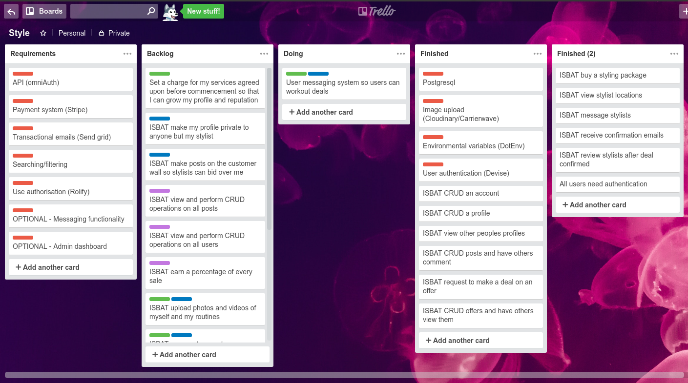
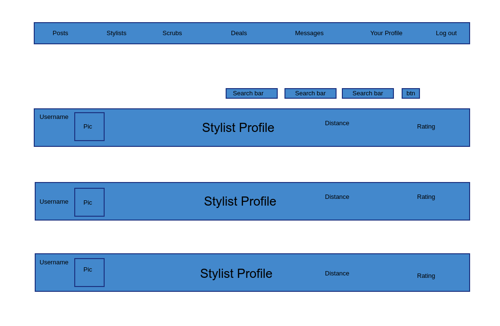
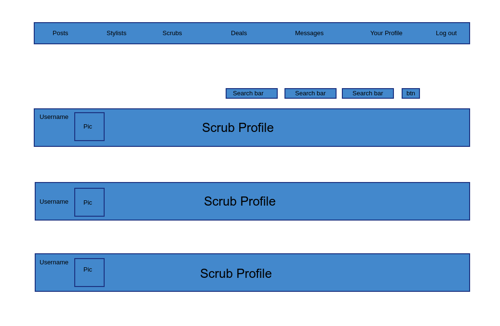
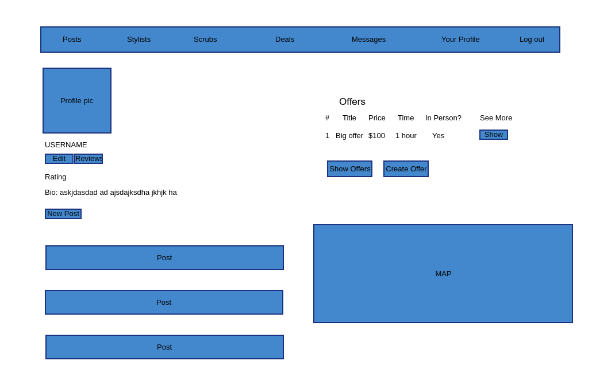
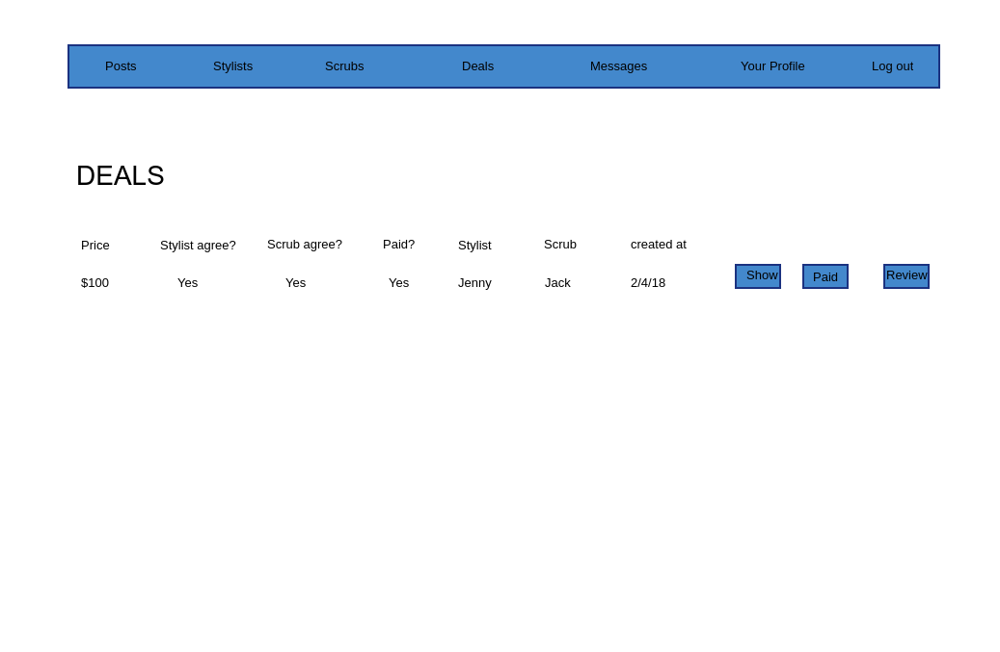
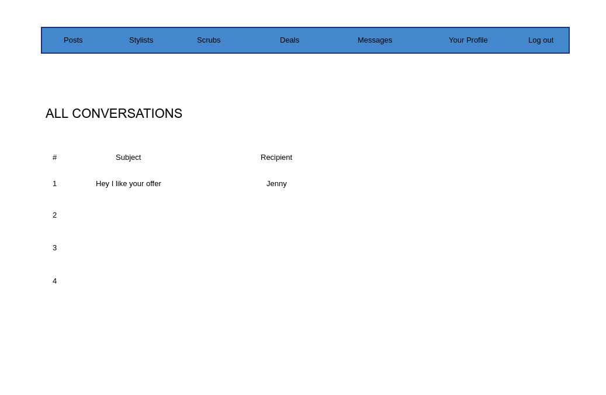

# README

link: https://crimes-of-fashion.herokuapp.com

github: https://github.com/jgeltchrobb/style_app

# Overview

1. Summary
2. Installation
3. User Stories
4. Wireframing
5. Workflow Diagram
6. Entity Relationship Diagram
7. List of Tools Used
8. Project Plan
9. Future Updates

## 1. Summary
This app was designed as part of the CoderAcademy assignment to build a two-sided marketplace.

PROBLEM

A lot of savvy app users are veritable gods in the digital sphere, yet they lack the ability to dress themselves for public consumption.

SOLUTION

This app aims to bridge the gap, connection fashionable people with those less so, allowing people to pay each other for styling advice.

The design for this app is based on a two sided marketplace framework whereby the unfashionable peons of this world may connect with those that have the nouse to assist them in conforming to the most superfluous of norms. This app allows for styling advice for a fraction of the cost of traditional methods.

## 2. Installation

Configuration - Create a .env file in your root directory for your own sendgrid and stripe API keys.

Clone the repo then change into the directory.
Run bundle install in terminal.
Run rails db:migrate in terminal.
You may run rails db:seed to start you off with 5 test users.

Create a .env file in the root of the directory, then add your own ENV variables :

- POSTGRES_DATABASE_PASSWORD=XXXX
- SENDGRID_USER=XXXX
- SENDGRID_PASS=XXXX
- STRIPE_PUBLISHABLE_KEY=XXXX
- STRIPE_SECRET_KEY=XXXX

## 3. User Stories

## 4. Wireframing

### Posts

### Stylists

### Scrubs

### Your profile

### Deals

### Messages

## 5. Workflow diagram

## 6. ERD

## 7. List of Tools Used

- Github - Version control, user stories and to assign story points for project management.
- rails erd (gem) - ERD
- postgresql - Database
- Devise - authentication
- bootstrap sass - styling
- Cloudflare - DNS server
- Webhosting - Heroku
- Sendgrid - emails
- Stripe - payments
- Rubocop - code quality
- Pencil- wireframing
- CarrierWave - image uploads
- dotenv-rails - environmental variables
- geocoder - longitude latitude geocoding
- Google Maps - map locations
- Rolify - Authorisation
- Sendgrid-ruby - production emails
- mailboxer - messaging

## 8. Project Plan

1. Basic Concept
  - ERD, user stories, wire frames
#### Design completed

2. Basic Functionality
  - Pages, MVCs, Devise, Heroku, bootstrap, routes
#### Skeleton app ready

3. Add Functionality
  - Add gems and API - cloudinary, carrierwave, geocoder, mailboxer, rolify, googleMaps
#### Gems and API installed

4. Implement more tools
  - Sendgrid, stripe(dev and production)
#### Production stage

5. Documentation and fix bugs
 - styling and heroku fixes
#### Completed to MVP

## 9. Bugs/Future Updates

1. Add multiple markers on maps to visually see distance from stylists
2. Some jQuery to get comments show/hide functionality
3. Admin dashboard
4. Stripe connect

